# DeepSparse vs OpenVINO Benchmark
[Blog Post with Full Details](https://vjraj.dev/blog/pruning_experiment)

**TLDR:** DeepSparse outperformed OpenVINO in throughput (img/s) by an average of 12%. It also excelled in all the lower-end compute scenarios tested and with most network architectures. However, on the m7i.xlarge instance (Intel Platinum 8488C), OpenVINO outperformed DeepSparse by an average of 17%.

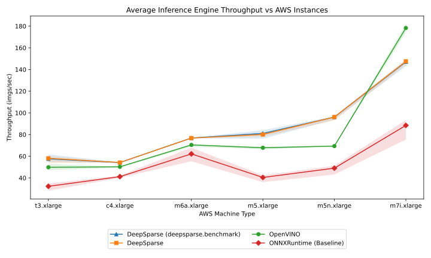

## Reproducting Results

### Select Models & AWS Instances
This benchmarking looked at the following models (base/pruned versions):
* vgg19 (model zoo)
* resnet50 (model zoo)
* mobilevit-xs (pruned by me)
* mobilenetv1 (model zoo)
* inceptionv3 (model zoo)
* efficientnet-b2 (pruned by me)
* efficientnet-b0 (pruned by me)

The following AWS instances were used to benchmark each model:
- [t3.xlarge](https://instances.vantage.sh/aws/ec2/t3.xlarge)
- [c4.xlarge](https://instances.vantage.sh/aws/ec2/c4.xlarge)
- [m6a.xlarge](https://instances.vantage.sh/aws/ec2/m6a.xlarge)
- [m5.xlarge](https://instances.vantage.sh/aws/ec2/m5.xlarge)
- [m5n.xlarge](https://instances.vantage.sh/aws/ec2/m5n.xlarge)
- [m7i.xlarge](https://instances.vantage.sh/aws/ec2/m7i.xlarge)

### Reproduce Pruning of Select Models
For each model that was not part of the NeuralMagic model zoo, there is a corresponding "sparsify_" python file. For every sparsify python file, the run command is simply ran with a `python` command. For `sparsify_quant_fake.py`, you must specific `--fake-yaml` and a `--model` argument.

### Reproduce Sensitivity Analysis of Select Models
Every sparsify python file has a flag called `--sensitivity`. Simply call it like so:

```bash
python sparsify_quant_efficientnet_b0_imagenet.py --sensitivity
```

## Reproduce Evaluation on AWS Instances
Select an appropriate PyTorch image and run the `aws_env.sh` script in the `scripts` folder to install some extra packages. The script also downloads the base and pruned model weights from a Google Drive location. If you're doing this with your own set of weights, please modify the Google Drive path or find another way to get the model weights onto the AWS instance.

To run the benchmark, simply run `run_deepsparse_benchmark.sh` in the `scripts` folder. You can modify the `n` parameter to increase script speed or reduce performance "noise".

## Methodology

I collected common “real-time” convolution-based classification networks and a transformer-based network called MobileViT in their base and pruned versions. Of the pruned models, MobileViT-xs, EfficientNet-B0, and EfficientNet-B2 were pruned by me, and the rest were collected from NeuralMagic's model zoo. All models were pruned using SparseML with the default Gradient Magnitude Pruning (GMP) method applied to convolutional and linear layers. Since hyperparameters for pruning are architecture-specific, there is no strict paradigm followed for the models I pruned. The top 10 layers of those models were analyzed for sensitivity by randomly masking the weights and calculating the validation accuracy on Imagenet-1k.

Sparsity values for each layer were subjectively chosen based on the sensitivity analysis. Following NeuralMagic's recommendation, the pruning process goes through a stabilization, pruning, and finetuning period with an initial learning rate of 0.01. I applied a gamma-based learning rate scheduler and reduced the LR during different parts of the pruning and finetuning stages. The pruning process I implemented requires additional work, as the pruned networks show notable decreases in accuracy on Imagenet-1k, but they serve as reasonable models for benchmarking.

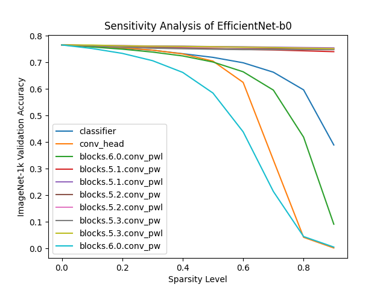

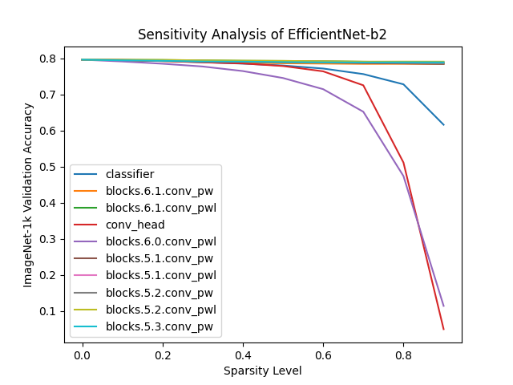

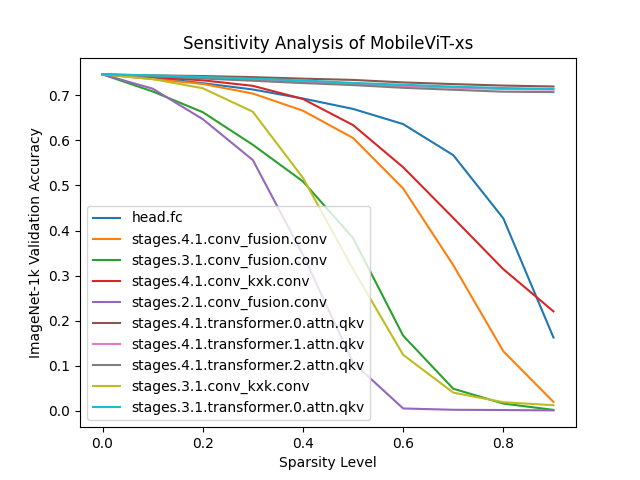


| Network Name       | Sparsity   | ImageNet-1k Validation Accuracy |
| ---------------------- | ----- | ----- |
| MobileViT-xs | 54% | 65.09% <b style="color: red;">(-9.52%)</b> |      
| EfficientNet-B0 | 61% | 71.75% <b style="color: red;">(-5.15%)</b> |
| EfficientNet-B2 | 62% | 77.37% <b style="color: red;">(-1.83%)</b> |


For each model, we export an ONNX version and run dummy inputs at the models' respective input size on ONNXRuntime, OpenVINO, and DeepStream (on the provided benchmarking tool as well as a separate Python that uses the API) inference engines. While testing, I saw that both DeepSparse methods yielded essentially the same results, but both were kept for the sake of completeness. Timing is measured with a simple `time.time()` before and after each inference call. Each inference engine was ran for 60 seconds (excluding the DeepSparse benchmark tool) and repeated 5 times to account for any noise.

## Results

Across all CPUs except the m7i.large, DeepSparse outperforms OpenVINO by an average of 12% in terms of throughput. On m7i.xlarge, OpenVINO sees a 28% jump in throughput compared to its 2nd best performing AWS instance (m6a.xlarge). On a per model basis, EfficientNet-b0, EfficientNet-b2, and MobileViT did not see significant speed-up when comparing the baseline model and pruned models. These models were ones that I had pruned, so it could be down to the sparisification recipe as well as the sparsity target not hitting an optimization threshold for any of the inference engine. In terms of performance across AWS instances, the increase in throughput was only seen on the higher-cost instances, which typically have stronger CPUs.

As an aside, the compressive affects of pruning can be seen in Table 2. I use gzip with the compression ratio set to 9 (highest available compression ratio) on all base and pruned models. Excluding ResNet50, which has a higher reduction ratio due to the INT8 datatype affecting filesize, the average reduction ratio is 2.99.


<figure>

| Network Name       | Original Size (MB)   | Optimized Size (MB) | Reduction Ratio |
| ---------------------- | ----- | ----- | ----- |
| MobileViT-xs | 8.62 | 4.24 | 2.03x |      
| EfficientNet-B0 | 19.59 | 8.60 | 2.28x |
| EfficientNet-B2 | 33.76 | 17.82 | 1.89x |
| ResNet50 <b style="color: red;">*</b> | 95.16 | 10.48 | 9.08x | 
| MobileNetv1 | 16.26 | 4.70 | 3.45x |  
| VGG19 | 533.10 | 110.34 | 4.83x |
| InceptionV3 | 88.63 | 25.37 | 3.49x |  

<figcaption>Table 2. Table shows the different sparsity levels and their affect on file size after gzip compression with the compression ratio set to 9 (the highest).</figcaption>

<b style="color: red;">*</b> - INT8 quantization was also applied.
</figure>

## Graphing Results

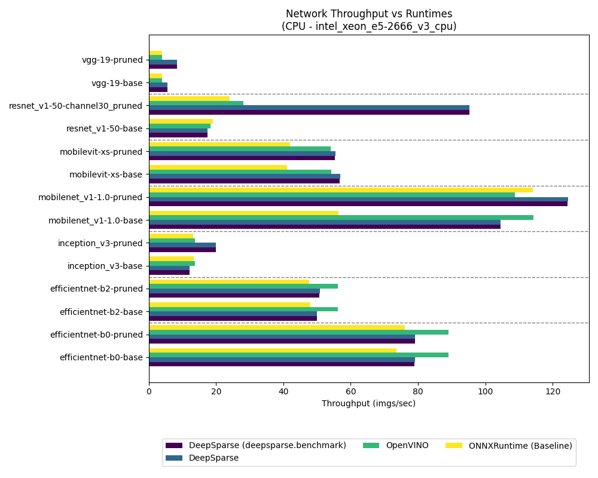

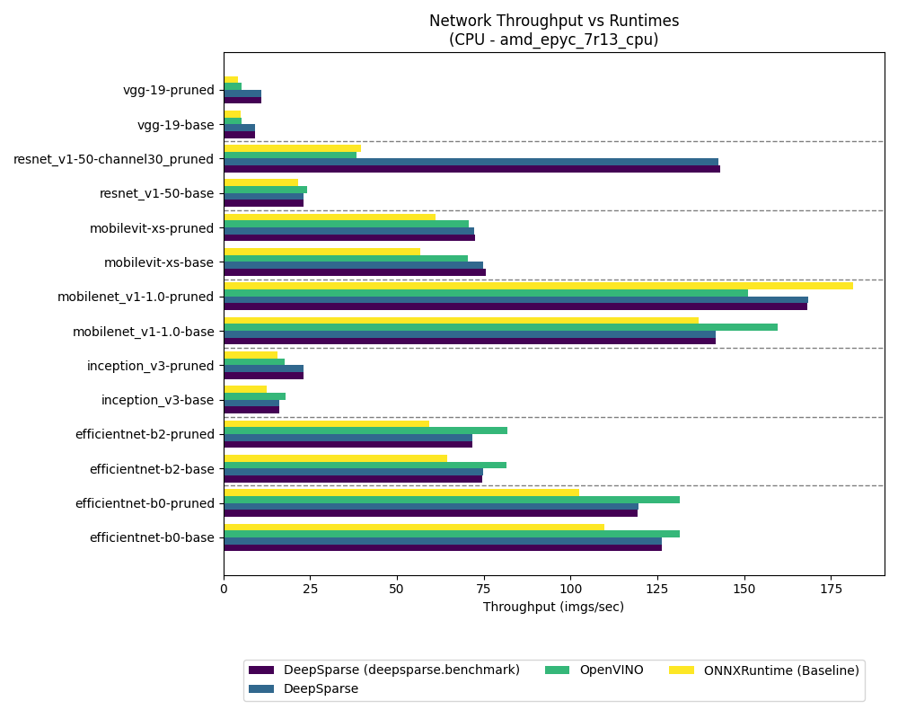

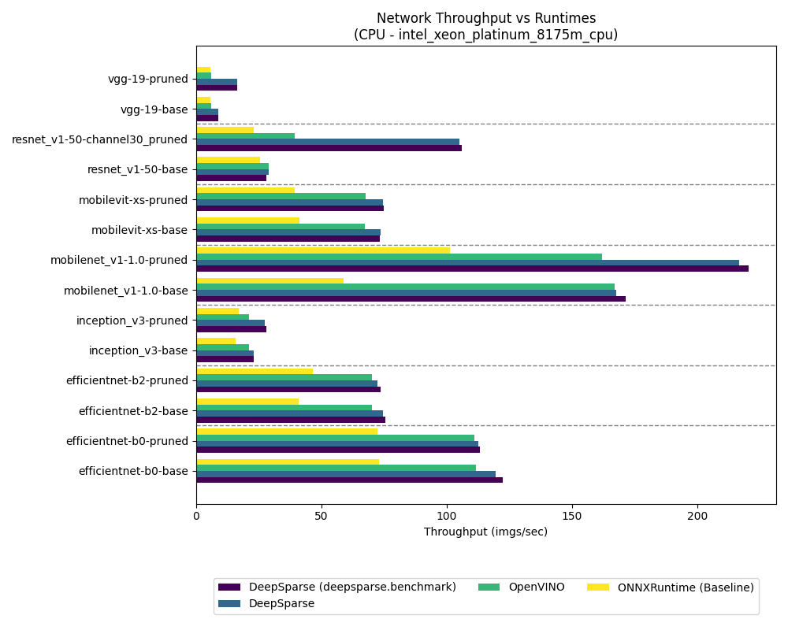

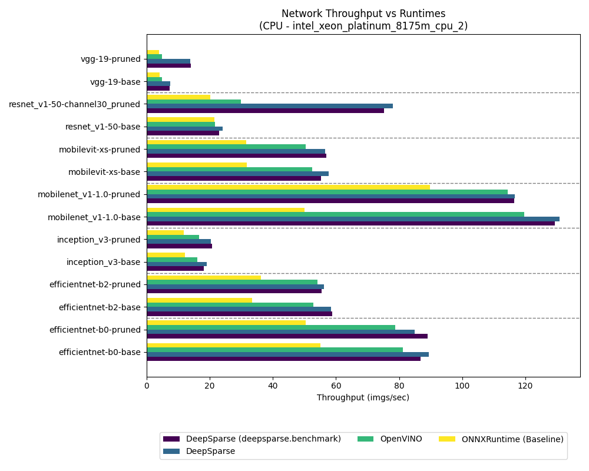

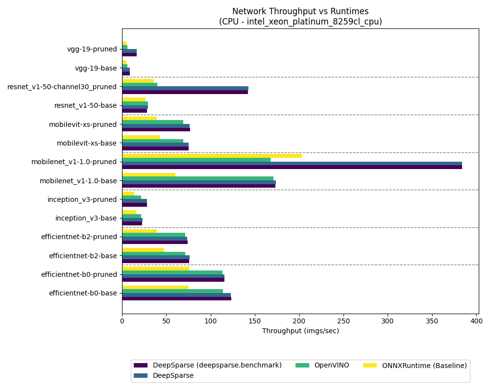

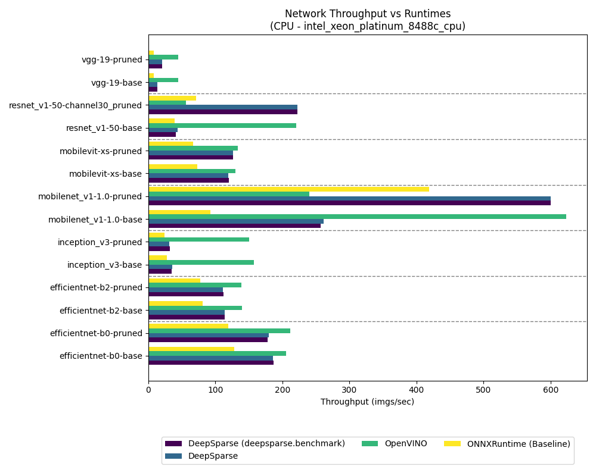


## Discussion

**1. Which inference engine was faster?**

From the results, it's **typically** DeepSparse. While there is a lot of naunce in terms of hardware and model architecutre, all but one AWS instance type consistently showed higher throughput for models on DeepSparse.

**2. What is the reason for the advantage?**

Since both inference engines are closed source, I can't tell you. But I would not be surprised if certain kernels in DeepSparse's arsenal were more optimized for these kinds of networks.

**3. Why didn't the EfficientNet and MobileViT networks see any throughput improvements after pruning?**

In the "Results" section, I alluded to the sparsity level not being high enough for any engine to take advantage of. I went back and did a pruning session on all three networks at 85% and 99% sparsity. This pruning attempt only focused on sparsity and not the model performance:

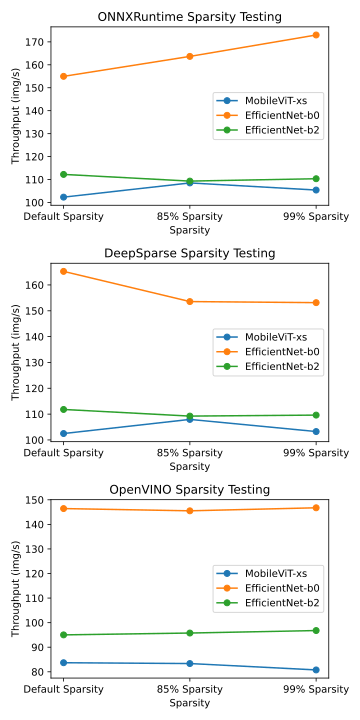

__N.B. CPU used was an AMD Ryzen 7 2700X__

Sparsity had little effect on the throughput speed for these networks. EfficientNet-b0 was the only network that saw an increase in throughput, but it was on ONNXRuntime. I don't fully understand why.

**4. How come OpenVINO was faster on m7i.xlarge?**

Similar to the points made in #2, I can't provide a definitive answer, but I believe it comes down to the CPU. After retrieving some public specifications for each CPU, I saw that the Intel Xeon Platinum 8488C is the newest CPU with VNNI support and a large L2 & L3 cache. It also had the highest maximum clock frequency amongst all the listed CPUs. These factors are likely the main reason why OpenVINO was faster.
    
